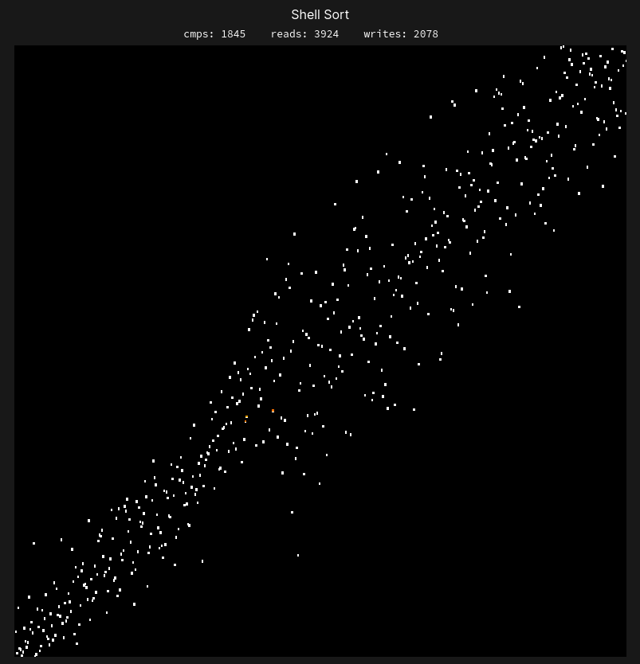

# Sorting Algorithm Visualizer using Python and PyQT5
This program visualizes various sorting algorithms graphically and keeps track of various sorting metrics. It also has support for playing sound.
The implementation allows for easy addition for additional algorithms. The background code visualizing the sorting
is completely invisible to the programmer of the sorting algorithm, which means that you can plug in a completely normal sorting code and it will be visualized without any extra work.

# [Video showcase](https://www.youtube.com/watch?v=cTGH0TSF7Y4)

## Implemented Algorithms
* Bubble Sort
* Insertion Sort
* Selection Sort
* Gnome Sort
* Cocktail Sort
* Merge Sort
* Quick Sort
* Heap Sort
* Comb Sort
* Shell Sort
* Counting Sort
* Radix Sort
* Python Timsort
* Bogosort
* Cubic Sort, O(n^3)

## Dependencies (Python 3):  
**Pillow** - Image handling `pip3 install pillow`  
**PyQT5** - GUI library `pip3 install PyQt5`  
To run the program, `./RUN.sh`

## Key bindings
**Space** - Pause/Resume Sorting  
**Left/Right** Increase/Decrease Sorting Speed  

## Rendering styles
The program supports four different rendering methods, each with support for coloring.
### **Bar graph**  

### **Point graph**  

### **Point spiral**  

### **Point circle (disparity)**  
